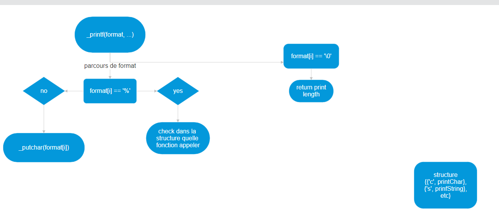

## Holbertonschool-printf

# Appendix
read the printf function

we can compile the project using this command line : gcc -Wall -Werror -Wextra -pedantic -std=gnu89 -Wno-format \*.c

## Requirements :


## Flowchart : 


## Run Locally

Clone the project

```bash
  git clone  https://github.com/Gromuf/holbertonschool-printf
```

Go to the project directory

```bash
  cd holbertonschool-printf

``` 
## 🚀 About Me
We are junior developer...

## Authors

- [@Gromuf](https://www.github.com/Gromuf)
- [@SDINAHET](https://www.github.com/SDINAHET)
